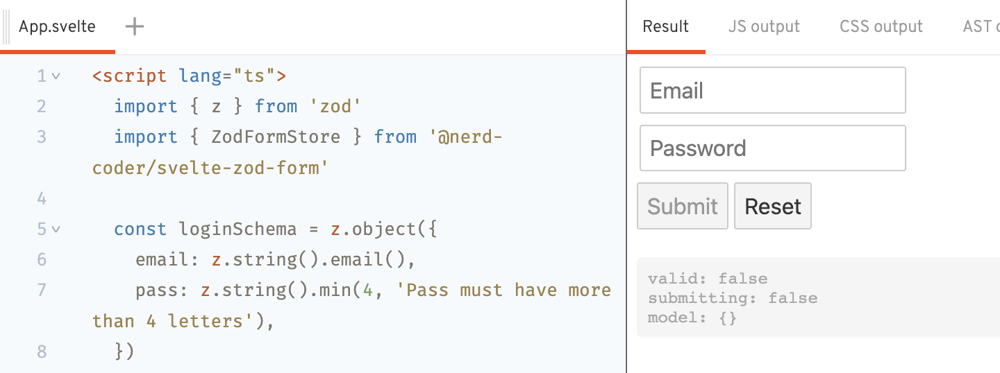

# 🌵 Svelte Zod Form

[![jsr]][jsr-link]
[![npm]][npm-link]
[![workflow]][workflow-link]
![license]
[![bundle]][bundle-link]
[![codecov]][codecov-link]

Building forms in Svelte with breeze, using [Zod](https://zod.dev/)

> [!NOTE]
> Currently upgrading to Svelte 5's Runes 🔥, stay tuned!

## Example

[REPL: Simple login form](https://svelte.dev/repl/33ff009d317745a389663c61ab228538)
[](<(https://svelte.dev/repl/33ff009d317745a389663c61ab228538)>)

## Installation

[NPM][npm-link]

```sh
npm i @nerd-coder/svelte-zod-form
```

[JSR][jsr-link] (Recommended)

```sh
npx jsr add @nerd-coder/svelte-zod-form
```

## How to use

First you need to create a Zod's schema

```ts
import { z } from 'zod'

const loginSchema = z.object({
  email: z.string().email(),
  pass: z.string().min(4),
})
```

Then pass the schema to `ZodFormStore`:

```ts
const form = new ZodFormStore(loginSchema, { onSubmit: v => console.log('Submitted values:', v) })
```

All the field's handler, value will be generated and typed for you:

```ts
// We need pull the generated field store out, in order
// to use the Svelte's "auto subscription" feature "$"
const { email_value, email_error, email_dirty, pass_value, pass_error, pass_dirty } = form.stores
```

Finally, use it in html

```svelte
<form on:submit|preventDefault={form.triggerSubmit}>
  <fieldset>
    <input
      name="email"
      on:input={form.fields.email.handleChange}
      on:blur={form.fields.email.handleBlur}
      value={$email_value || ''}
      class:invalid={!!$email_error}
      class:valid={!$email_error && !!$email_dirty}
    />
    {#if $email_error}<p>{$email_error}</p>{/if}
  </fieldset>

  <fieldset>
    <input
      name="pass"
      type="password"
      on:input={form.fields.pass.handleChange}
      on:blur={form.fields.pass.handleBlur}
      value={$pass_value || ''}
      class:invalid={!!$pass_error}
      class:valid={!$pass_error && !!$pass_dirty}
    />
    {#if $pass_error}<p>{$pass_error}</p>{/if}
  </fieldset>

  <button type="submit">Sign In</button>
</form>
```

## Configuration

### `initialValue`

- type: `Partial<T>`
- required: `false`
- default: `undefined`

The initial data in the form. Will revert to this value if call `form.reset`.

```ts
const form = new ZodFormStore(schema, {
  initialValue: { email: 'my@email.com' },
  ...
})
```

### `onSubmit`

- type: `(v: T) => Promise<void | string> | string | void`
- required: `true`

Async callback to handle submmition of the form. Should return nothing, or an `string` contain error message

```ts
const form = new ZodFormStore(schema, {
  onSubmit: (values) => console.log('Submitted values:', values),
  ...
})
```

### `debug`

- type: `boolean`
- required: `false`
- default: `false`

Print various debug messages.

```ts
const form = new ZodFormStore(schema, {
  debug: true,
  ...
})
```

## API

| Prop            | Type                              | Description                                                                                                       |
| --------------- | --------------------------------- | ----------------------------------------------------------------------------------------------------------------- |
| model           | `Readable<T>`                     | Form's data. Will be passed to onSubmit handler                                                                   |
| options         | `readonly ZodFormStoreOptions<T>` | Form settings. Should not be update                                                                               |
| triggerSubmit   | `() => Promise<void>`             | Function to start parsing, validating and submit the form's data                                                  |
| setupAutoSubmit | `(delay: number) => Unsubscriber` | Setup auto submit on every change of the model                                                                    |
| reset           | `() => void`                      | Function to reset the form to original state.                                                                     |
| submitting      | `Readable<boolean>`               | True of submitting the form.                                                                                      |
| error           | `Readable<string>`                | Error message returned from `onSubmit` handler, or custom validation message.                                     |
| errors          | `Readable<string[]>`              | Array of string contains all error messages (including fields's errors and error return from `onSubmit` handler). |
| dirty           | `Readable<boolean>`               | Indicate if the form is edited or submitted.                                                                      |
| valid           | `Readable<boolean>`               | Indicate if the form is valid.                                                                                    |
| fields          | `object`                          | Generated fields's functions.                                                                                     |
| stores          | `object`                          | Generated fields's stores.                                                                                        |

### Generated stores's props

| Prop                          | Type                       | Description                                |
| ----------------------------- | -------------------------- | ------------------------------------------ |
| stores._`fieldName`_\_value   | `Readable<T['fieldName']>` | Readable store holding field's value       |
| stores._`fieldName`_\_touched | `Readable<boolean>`        | The field have been touched or not         |
| stores._`fieldName`_\_dirty   | `Readable<boolean>`        | The field value been changed or not        |
| stores._`fieldName`_\_error   | `Readable<string>`         | The field validation error message, if any |
| stores._`fieldName`_\_valid   | `Readable<boolean>`        | The field value is valid or not            |

### Generated field's functions

| Prop                              | Type                                         | Description                       |
| --------------------------------- | -------------------------------------------- | --------------------------------- |
| fields._`fieldName`_.updateValue  | `(updater: Updater<T['fieldName']>) => void` | Function to update field's value  |
| stores._`fieldName`_.setValue     | `(val: T['fieldName']) => void`              | Function to set field's value     |
| stores._`fieldName`_.handleChange | `(val: unknown) => void`                     | Callback to update field's value  |
| stores._`fieldName`_.handleBlur   | `() => void`                                 | Callback to mark field as touched |
| stores._`fieldName`_.reset        | `() => void`                                 | Reset field to original state     |
| stores._`fieldName`_.setError     | `(msg: string) => void`                      | Manually set field error          |
| stores._`fieldName`_.setTouched   | `(val: boolean) => void`                     | Manually set touched state        |

## Features

- Use Svelte native stores
- Fine-grained reactivity (currently up to field level)
- Validation using Zod (Peer dependencies)
- TypeScript
- Minimal [![bundle]][bundle-link]

## Extra

Why the cactus 🌵?

\> For its resilience

## TODO

- More tests
- Support nested object
- Support array

## Contributions

Any contributions are highly appreciate, please make a pull-request. If you would like to discuses a new feature, please create an issue first.

[jsr]: https://jsr.io/badges/@nerd-coder/svelte-zod-form
[jsr-link]: https://jsr.io/@nerd-coder/svelte-zod-form
[npm]: https://img.shields.io/npm/v/%40nerd-coder%2Fsvelte-zod-form?logo=npm&labelColor=%23CB3837&color=%23213949
[npm-link]: https://www.npmjs.com/package/@nerd-coder/svelte-zod-form
[workflow]: https://github.com/nerd-coder/svelte-zod-form/actions/workflows/main.yaml/badge.svg
[workflow-link]: https://github.com/nerd-coder/svelte-zod-form/actions/workflows/main.yaml
[bundle]: https://badgen.net/bundlephobia/minzip/@nerd-coder/svelte-zod-form?icon=packagephobia&label=bundlephobia
[bundle-link]: https://bundlephobia.com/package/@nerd-coder/svelte-zod-form
[codecov]: https://codecov.io/gh/nerd-coder/svelte-zod-form/branch/main/graph/badge.svg?token=60IHHKQJ1Y
[codecov-link]: https://codecov.io/gh/nerd-coder/svelte-zod-form
[license]: https://img.shields.io/github/license/nerd-coder/svelte-zod-form
